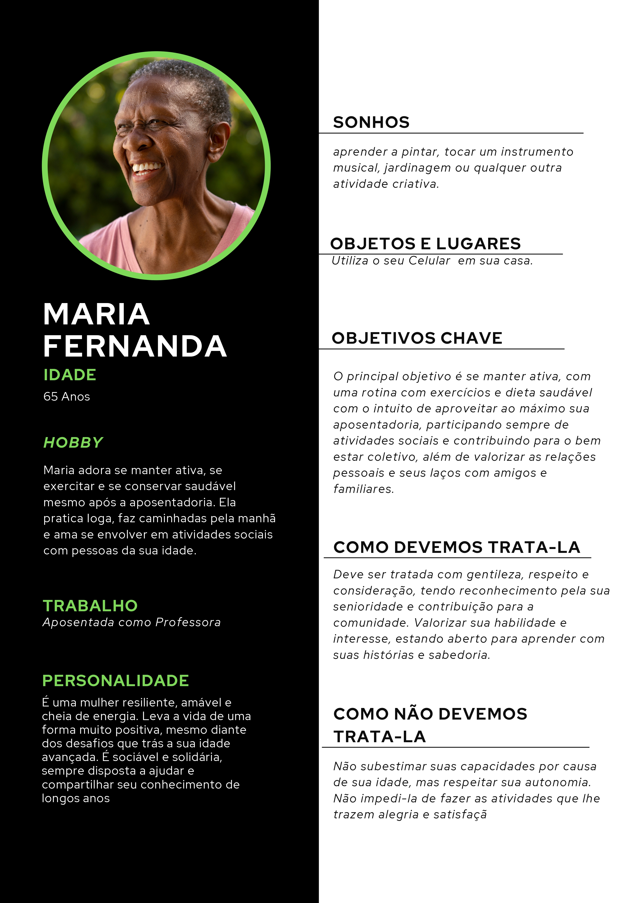
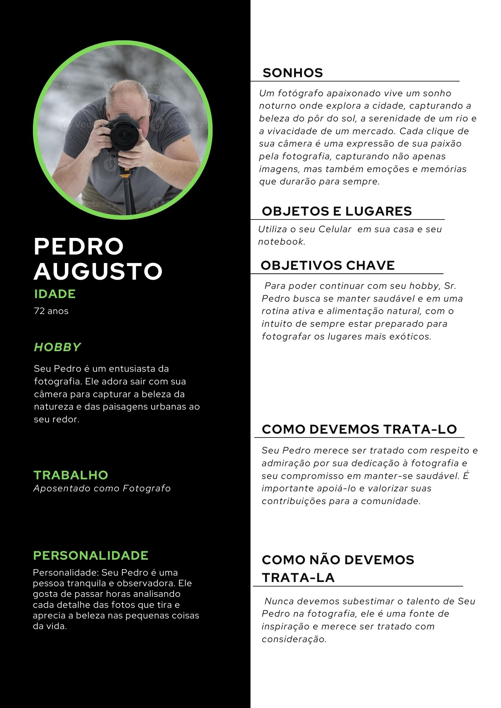
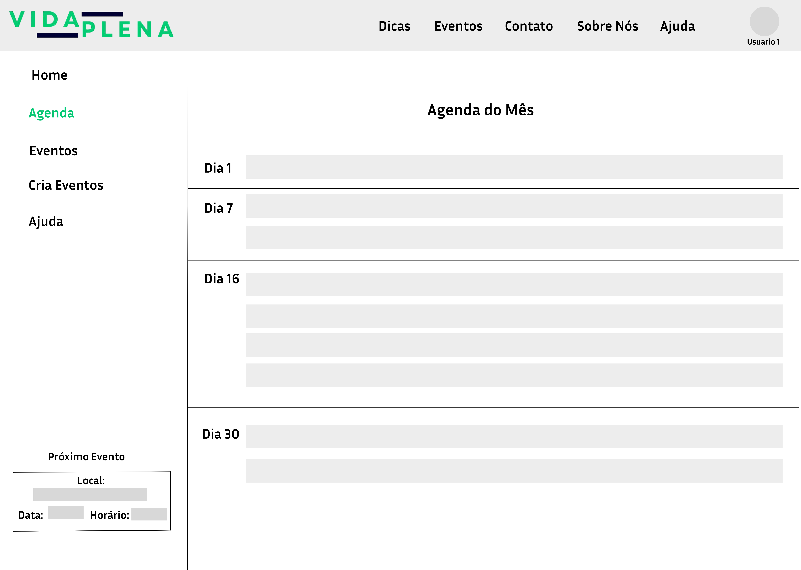

# Informações do Projeto
`TÍTULO DO PROJETO`  

Vida Plena

`CURSO` 

Analise e Desenvolvimento de Sistemas.

## Participantes
> Os membros do grupo são:
> - Domiciano Gabriel Negrini Vieira
> - Igor Ferreira Ramos
> - João Vitor Filgueira Araújo de Castro
> - Lucas Phillipe Freitas Dias
> - Luiz Ribeiro de Andrade Neto
> - Pedro Henrique Freitas Dias

# Estrutura do Documento

- [Informações do Projeto](#informações-do-projeto)
  - [Participantes](#participantes)
- [Estrutura do Documento](#estrutura-do-documento)
- [Introdução](#introdução)
  - [Problema](#problema)
  - [Objetivos](#objetivos)
  - [Público-Alvo](#público-alvo)
- [Especificações do Projeto](#especificações-do-projeto)
  - [Personas](#personas)
  - [Histórias de Usuários](#histórias-de-usuários)
  - [Requisitos](#requisitos)
- [Projeto da Solução](#projeto-da-solução)
  - [Wireframes](#wireframes)
  - [Mapa de navegação](#mapa-de-navegação)
- [Conclusões](#avaliação-da-aplicação)
  
# Introdução

Você sabia que a prática regular de atividades cognitivas, como jogos de quebra-cabeça, leitura e aprendizado de novas habilidades, pode ajudar a manter a mente afiada e até mesmo reduzir o risco de desenvolver demência? Estudos mostram que manter o cérebro ativo pode ter benefícios significativos para a saúde mental e cognitiva à medida que envelhecemos. Então, incentivar os idosos a se envolverem em atividades intelectualmente estimulantes pode ser uma ótima maneira de promover um envelhecimento saudável e vibrante!

## Problema

É notório no Brasil a recorrência do assunto relacionado a saúde mental dos idosos nos noticiários. Alguns dados fornecidos pela Scielo, dizem que "As taxas de suicídio mais elevadas concentram-se na população acima de 80 anos", assim como outro dado apresentado pelo Governo Federal que constata que "Em 2019, os idosos entre 60 e 64 anos representavam a faixa etária proporcionalmente mais afetada: 13,2% tinham sido diagnosticados com depressão", evidenciando portanto, um problema que ocorre por todo o Brasil, tornando-se assim uma preocupação nacional.

## Objetivos

Bem-vindo ao Vida Plena - o seu espaço digital para conectar-se, celebrar e viver a vida. Estamos aqui para criar momentos significativos e enriquecedores para a comunidade de idosos, onde cada evento e campanha é uma oportunidade única de encontrar novas amizades, compartilhar experiências e explorar tudo o que a vida tem para te oferecer. Junte-se a nós enquanto navegamos por uma jornada de conexão, vitalidade e alegria, moldada pelos valores da comunidade, empatia e respeito mútuo. Está na hora de abraçar a vida plenamente - e estamos aqui para ajudá-lo nessa jornada.

Buscamos desenvolver um software que busca incluir pessoas por meio de eventos e campanhas, e ter informações Relevantes para a Saude e Bem estar,
Iremos apronfundar o desenvolvimento de inclusão por meio de eventos criado pelo site e informações de saude e um feed que terá informações sobre Saude.

## Público-Alvo

Pessoas acima de 65 anos, que desejam fazer novas amizades, participar de eventos e atividades sociais, que buscam informações sobre saúde, bem-estar físico e mental, dicas de exercícios adequados à idade, nutrição e cuidados preventivos.

# Especificações do Projeto

> Plataforma que promove encontros de pessoas.
> Feed de informações de Saude e Bem estar.

## Personas

> 
> 
 
## Histórias de Usuários

Com base na análise das personas forma identificadas as seguintes histórias de usuários:

|EU COMO... `PERSONA`| QUERO/PRECISO ...      `FUNCIONALIDADE`   |PARA ... `MOTIVO/VALOR`                 |
|--------------------|-------------------------------------------|----------------------------------------|
|Usuário do sistema  | Criação de  Eventos                       | Não esquecer de fazê-las               |
|Administrador       | criação de Post                           | Permitir que possam administrar contas |
|Administrador       | Excluir ou Editar Evento                  | Permitir que possam administrar contas |
|Usuário do sistema  | Visualização de Eventos e Post Existentes | Não esquecer de fazê-las               |

> Seguindo o modelo acima, apresente aqui as histórias de usuário que são relevantes para o
> projeto de sua solução. As Histórias de Usuário consistem em uma
> ferramenta poderosa para a compreensão e elicitação dos requisitos
> da sua aplicação. Utilize as personas criadas como atores e, se for o caso, um administrador. 
>
> **Links Úteis**:
> - [Histórias de usuários com exemplos e template](https://www.atlassian.com/br/agile/project-management/user-stories)
> - [Como escrever boas histórias de usuário (User Stories)](https://medium.com/vertice/como-escrever-boas-users-stories-hist%C3%B3rias-de-usu%C3%A1rios-b29c75043fac)

## Requisitos

### Requisitos Funcionais
A tabela a seguir apresenta os requisitos funcionais que o projeto deverá atender.

|ID    |             Descrição do Requisito                 | Prioridade |
|------|------------------------------------------------------|-------|
|RF-001| Permitir que o Usuario Cadastre e faça Login.        | ALTA  | 
|RF-002| Permitir que o Usuario Crie seu Evento.              | ALTA  |
|RF-003| Permitir que o Usuario Compartilhe Evento.           | ALTA  |
|RF-004| Permitir que o Usuario consulte eventos disponiveis. | ALTA  |
|RF-005| O sistema devera notificar o usuario de seu evento.  | MÉDIA |
|RF-006| Permitir que o Usuario consulte suas duvidas.        | ALTA  |

### Requisitos não Funcionais
A tabela a seguir apresenta os requisitos não funcionais que o projeto deverá atender.

|ID    |               Descrição do Requisito                               | Prioridade |
|------|-----------------------------------------------------------------------|-------|
|RF-001| O site deve ter interface simples e agradável ao usuário              | ALTA  | 
|RF-005| O site deve ser responsivo e funcionar em desktop, celular e tablet.  | ALTA  |
|RF-006| O site deve ser compatível com os principais navegadores do mercado.  | ALTA  |

### Restrições 
As questões que limitam a execução desse projeto e que se configuram como obrigações claras para o desenvolvimento do projeto em questão são apresentadas na tabela a seguir.

ID	Restrição
01	O projeto deverá ser entregue no final do semestre letivo de 2023
02	O site deve se restringir às tecnologias básicas da Web no Frontend
03	A equipe não pode subcontratar o desenvolvimento do trabalho
04	A equipe, caso utilize, fará da inteligência artificial uma ferramenta, e não uma plataforma de desenvolvimento de código.

# Projeto da Solução

> Será Utilizado as tecnologias aprendidas Durante o Primeiro Semestre de Desenvolvimento de Sistemas Web.
> Utilizamos as Linguagens HTML5, CSS3 e JavaScript.
> Utilizamos Também a Ferramenta Figma para a criação do WireFrame.
> Utilizamos a Ferramenta Miro para Edição e Criação Da Matriz CSD, Brainstorming, Mapa de Stakeholders e Entrevista Qualitativa. 

## Wireframes
> Tela Principal onde o Usuário irar escolher o que ele deseja ver, se será criação de Eventos, Localizar Eventos Disponivels ou Feed de Informações.
> 

> Tela que irar informar data com todos os eventos criado e disponivels no site.
> 

## Mapa de navegação

......  COLOQUE AQUI O SEU TEXTO OU DIAGRAMA DE NAVEGAÇÃO .......

> Inclua uma descrição textual ou um diagrama mostrando, sequencialmente, quais ações
> um usuário deve realizar para utilizar todas as características do seu sistema. 

> **Exemplo de Diagrama (opcional, pode ser em texto)**
> 

# Conclusões

......  COLOQUE AQUI O SEU TEXTO ......

> Finalize escrevendo um ou dois parágrafos para relembrar o objetivo do projeto, 
> o que foi possível alcançar e o que ficou para um trabalho futuro, e relembrando
> as principais dificuldes encontradas e como foi possível contorná-las. 

