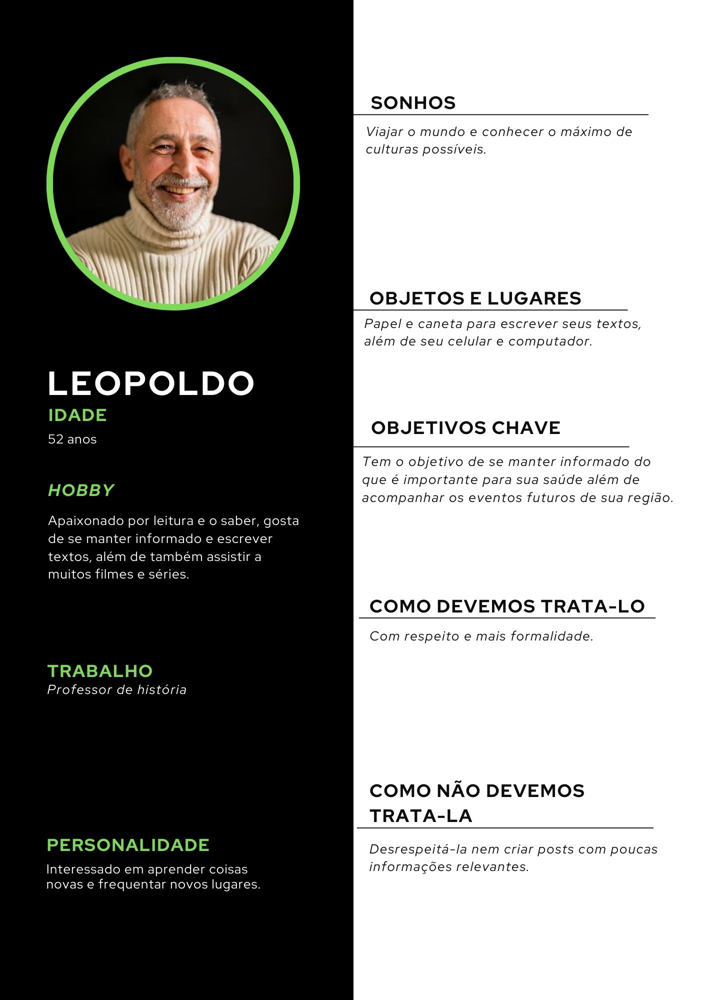
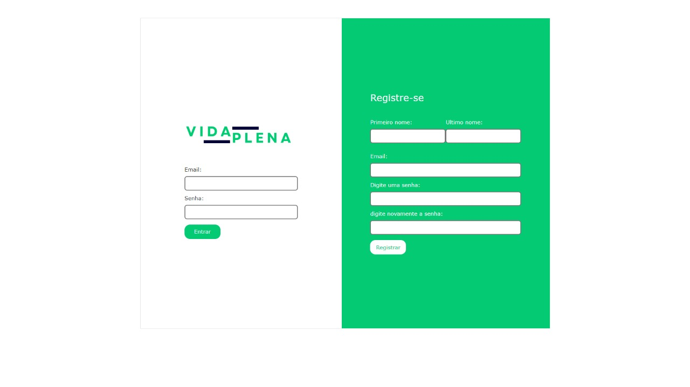
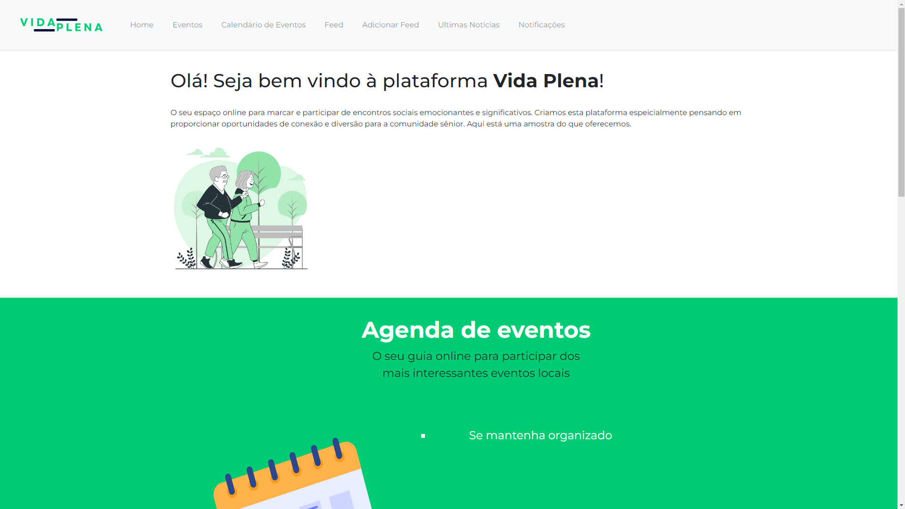
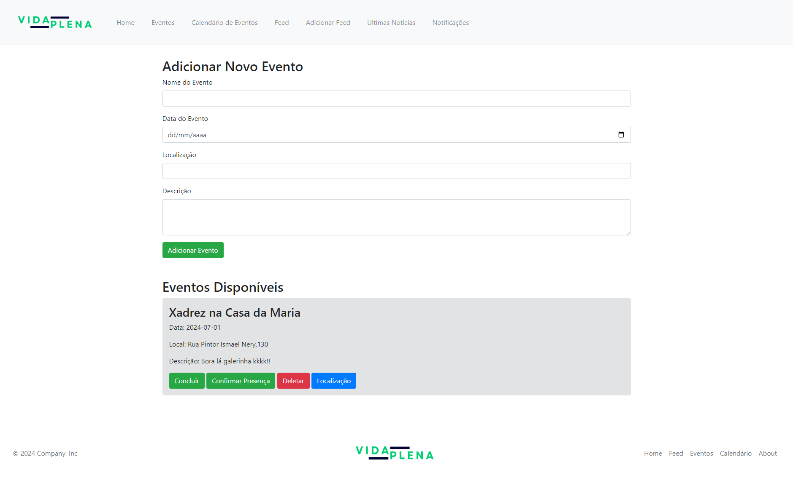
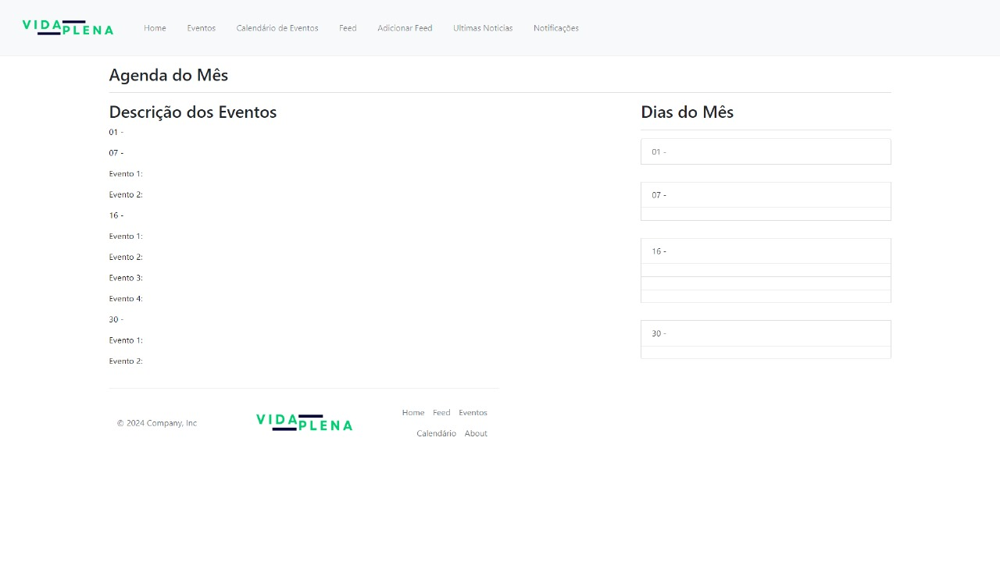
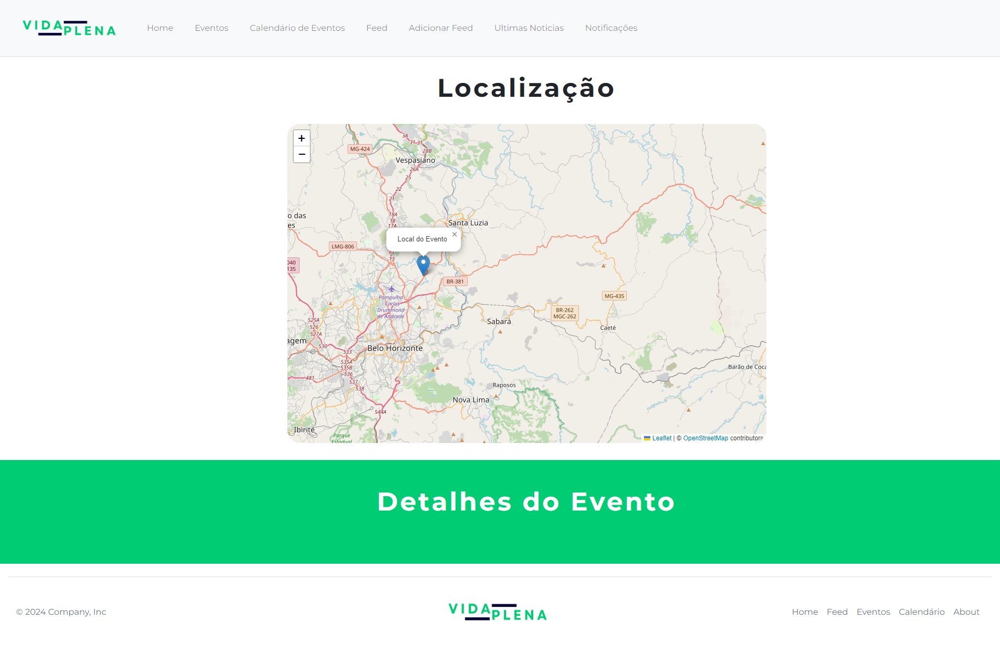
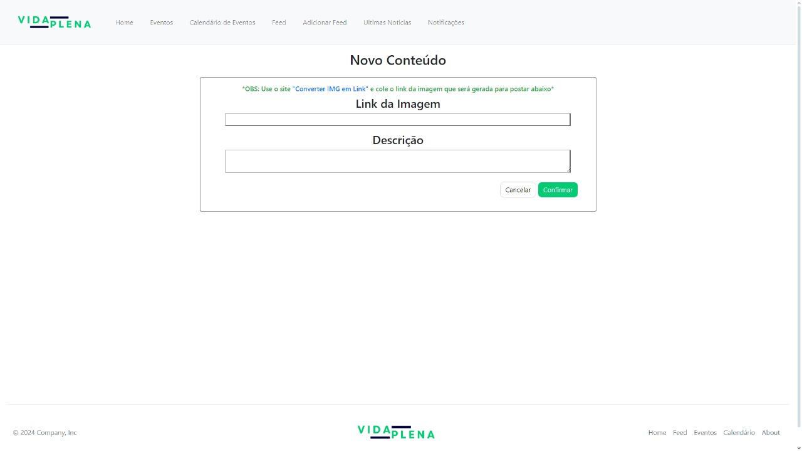
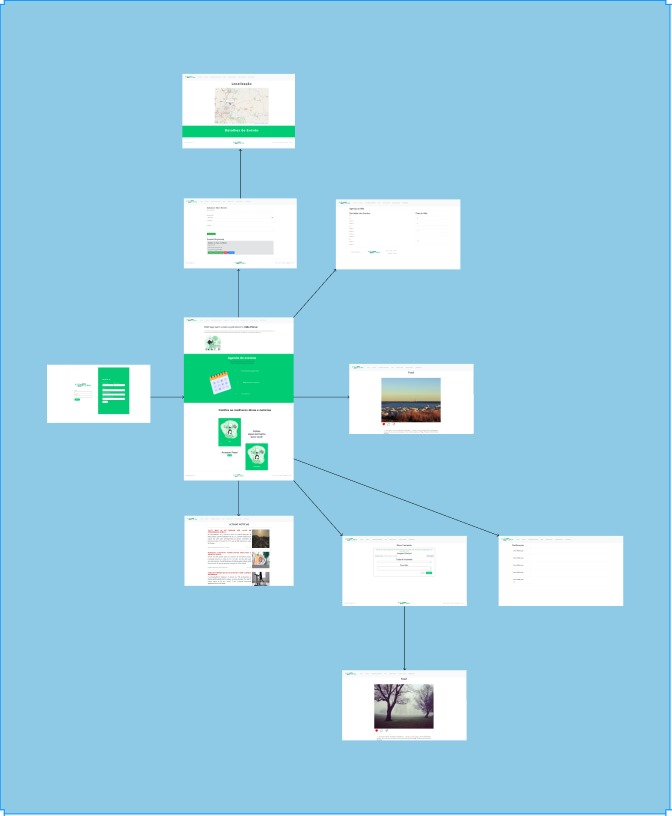
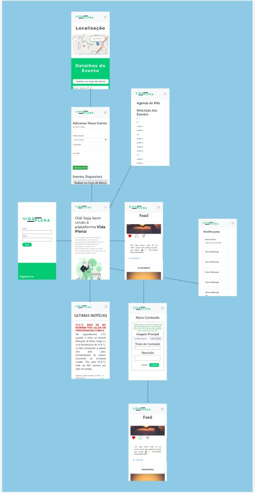

# Informações do Projeto
`TÍTULO DO PROJETO`  

Vida Plena

`CURSO` 

Análise e Desenvolvimento de Sistemas.

## Participantes
> Os membros do grupo são:
> - Domiciano Gabriel Negrini Vieira
> - Igor Ferreira Ramos
> - João Vitor Filgueira Araújo de Castro
> - Lucas Phillipe Freitas Dias
> - Pedro Henrique Freitas Dias

# Estrutura do Documento

- [Informações do Projeto](#informações-do-projeto)
  - [Participantes](#participantes)
- [Estrutura do Documento](#estrutura-do-documento)
- [Introdução](#introdução)
  - [Problema](#problema)
  - [Objetivos](#objetivos)
  - [Público-Alvo](#público-alvo)
- [Especificações do Projeto](#especificações-do-projeto)
  - [Personas](#personas)
  - [Histórias de Usuários](#histórias-de-usuários)
  - [Requisitos](#requisitos)
- [Projeto da Solução](#projeto-da-solução)
  - [Wireframes](#wireframes)
  - [Mapa de navegação](#mapa-de-navegação)
- [Conclusões](#avaliação-da-aplicação)
  
# Introdução

O projeto visa reduzir a depressão entre idosos, proporcionando-lhes acesso a uma plataforma comunitária onde possam criar e participar de eventos, compartilhar experiências e receber informações relevantes sobre saúde e bem-estar. Além disso, a plataforma oferecerá ferramentas específicas para promover o engajamento ativo dos idosos na comunidade.

Nosso objetivo é:

Criar uma comunidade engajada, promover saúde e bem-estar e desenvolver ferramentas específicas
Espera-se que o projeto resulte em uma redução na taxa de solidão, melhoria da saúde mental, promoção de estilos de vida ativos e aumento da qualidade de vida dos idosos.

Os principais stakeholders do projeto incluem familiares próximos, proprietários de lojas associadas e a própria comunidade idosa.

## Problema

É notório no Brasil a recorrência do assunto relacionado a saúde mental dos idosos nos noticiários. Alguns dados fornecidos pela Scielo, dizem que "As taxas de suicídio mais elevadas concentram-se na população acima de 80 anos", assim como outro dado apresentado pelo Governo Federal que constata que "Em 2019, os idosos entre 60 e 64 anos representavam a faixa etária proporcionalmente mais afetada: 13,2% tinham sido diagnosticados com depressão", evidenciando portanto, um problema que ocorre por todo o Brasil, tornando-se assim uma preocupação nacional.
- Fontes:
  https://www.scielosp.org/pdf/rsp/2004.v38n6/804-810/pt
  https://www.gov.br/mdh/pt-br/navegue-por-temas/observatorio-nacional-da-familia/fatos-e-numeros/5.SADEMENTAL28.12.22.pdf

## Objetivos

Bem-vindo ao Vida Plena - o seu espaço digital para conectar-se, celebrar e viver a vida. Estamos aqui para criar momentos significativos e enriquecedores para a comunidade de idosos, onde cada evento e campanha é uma oportunidade única de encontrar novas amizades, compartilhar experiências e explorar tudo o que a vida tem para te oferecer. Junte-se a nós enquanto navegamos por uma jornada de conexão, vitalidade e alegria, moldada pelos valores da comunidade, empatia e respeito mútuo. Está na hora de abraçar a vida plenamente - e estamos aqui para ajudá-lo nessa jornada.

Buscamos desenvolver um software que busca incluir pessoas por meio de eventos e campanhas, e ter informações Relevantes para a Saude e Bem estar,
Iremos apronfundar o desenvolvimento de inclusão por meio de eventos criado pelo site e informações de saude e um feed que terá informações sobre Saude.

## Público-Alvo

Pessoas acima de 65 anos, que desejam fazer novas amizades, participar de eventos e atividades sociais, que buscam informações sobre saúde, bem-estar físico e mental, dicas de exercícios adequados à idade, nutrição e cuidados preventivos.

# Especificações do Projeto

> Plataforma que promove encontros de pessoas.
> Feed de informações de Saude e Bem estar.

## Personas

> Persona: Maria
> 
> Persona: Pedro
> 
> > Persona: leopoldo
> 
 
## Histórias de Usuários

Com base na análise das personas forma identificadas as seguintes histórias de usuários:

|EU COMO... `PERSONA`| QUERO/PRECISO ...      `FUNCIONALIDADE`   |PARA ... `MOTIVO/VALOR`                                                                                                           |
|--------------------|-------------------------------------------|----------------------------------------------------------------------------------------------------------------------------------|
|Usuário do sistema  | Criação de Eventos                        | Me conectar com outras pessoas de minha idade.                                                                                   |
|Usuário do sistema  | Participar de eventos                     | Eu quero ver e participar de eventos criados por outros usuários.                                                                |
|Usuário do sistema  | Informações de Saúde                      | Eu quero receber informações relevantes sobre saúde e bem-estar.                                                                 |
|Usuário do sistema  | Criar um post                             | Eu quero compartilhar experiências em um feed.                                                                                   |
|Usuário do sistema  | Uso do mapa                               | Eu quero utilizar um mapa no site. Para que eu possa encontrar a localização exata dos eventos e planejar minha ida.             | 
|Usuário do sistema  | Gerenciar agenda                          | Para que eu possa acompanhar os eventos em que me inscrevi e me organizar.                                                       |
|Usuário do sistema  | Gerenciar evento                          | Poder excluir ou marca evento como concluído.                                                                                    |
|Usuário do sistema  | Checar as notificações                    | Eu quero receber notificações sobre novos eventos e atividades.                                                                  |
|Usuário do sistema  | Poder comentar em publicações             | Eu quero poder comentar nas postagens de outros usuários. Para que eu possa interagir e compartilhar minhas opiniões e sugestões.|
|Usuário do sistema  | Compartilhar os post em outras redes      | Eu quero compartilhar publicações que eu acho interessantes ou importantes.                                                      |
|Usuário do sistema  | Visualização de Eventos e Post Existentes | Não esquecer de fazê-las.                                                                                                        |

> Seguindo o modelo acima, apresente aqui as histórias de usuário que são relevantes para o
> projeto de sua solução. As Histórias de Usuário consistem em uma
> ferramenta poderosa para a compreensão e elicitação dos requisitos
> da sua aplicação. Utilize as personas criadas como atores e, se for o caso, um administrador. 
>
> **Links Úteis**:
> - [Histórias de usuários com exemplos e template](https://www.atlassian.com/br/agile/project-management/user-stories)
> - [Como escrever boas histórias de usuário (User Stories)](https://medium.com/vertice/como-escrever-boas-users-stories-hist%C3%B3rias-de-usu%C3%A1rios-b29c75043fac)

## Requisitos

### Requisitos Funcionais
A tabela a seguir apresenta os requisitos funcionais que o projeto deverá atender.

|ID    |             Descrição do Requisito                                                                         | Prioridade |
|------|-----------------------------------------------------------------------------------------------------------------|-------|
|RF-001| Permitir que o Usuario Cadastre e faça Login.                                                                   | ALTA  | 
|RF-002| Permitir que o Usuario Crie seu Evento.                                                                         | ALTA  |
|RF-003| Permitir que o Usuario Compartilhe Evento.                                                                      | ALTA  |
|RF-004| Permitir que o Usuario consulte eventos disponiveis.                                                            | ALTA  |
|RF-005| O sistema devera notificar o usuario de seu evento.                                                             | MÉDIA |
|RF-006| Permitir que o Usuario consulte suas duvidas.                                                                   | ALTA  |
|RF-007| O sistema deve permitir que os usuários se inscrevam em eventos de interesse.                                   | MÉDIA |
|RF-008| O sistema deve ter um feed onde os usuários idosos possam compartilhar suas experiências e histórias.           | MÉDIA |
|RF-009| O sistema deve fornecer informações relevantes sobre saúde e bem-estar aos usuários.                            | ALTA  |
|RF-010| O sistema deve incluir um mapa para que os usuários possam encontrar a localização exata dos eventos.           | MÉDIA |
|RF-011| O sistema deve oferecer uma agenda onde os usuários possam acompanhar os eventos em que se inscreveram.         | MÉDIA |
|RF-012| O sistema deve enviar notificações aos usuários sobre novos eventos e atividades.                               | MÉDIA |
|RF-013| O sistema deve permitir que os usuários comentem nas postagens de outros usuários.                              | ALTA  |
|RF-014| O sistema deve permitir que os usuários compartilhem publicações interessantes ou importantes com a comunidade. | ALTA  |
|RF-015| O sistema deve mostrar os nomes dos usuários inscritos em cada evento.                                          | BAIXA |

### Requisitos não Funcionais
A tabela a seguir apresenta os requisitos não funcionais que o projeto deverá atender.

|ID    |               Descrição do Requisito                                                                                                | Prioridade |
|------|------------------------------------------------------------------------------------------------------------------------------------------|-------|
|RF-001| A interface do usuário deve ser intuitiva e fácil de navegar, especialmente para idosos com pouca experiência em tecnologia.             | ALTA  | 
|RF-002| O sistema deve ser responsivo, adaptando-se adequadamente a diferentes tamanhos de tela e dispositivos, incluindo smartphones e tablets. | ALTA  |
|RF-003| O código do sistema deve ser bem documentado para facilitar a manutenção e futuras atualizações.                                         | MÉDIA |

### Restrições 
As questões que limitam a execução desse projeto e que se configuram como obrigações claras para o desenvolvimento do projeto em questão são apresentadas na tabela a seguir.

ID	Restrição
01	O projeto deverá ser entregue no final do semestre letivo de 2023
02	O site deve se restringir às tecnologias básicas da Web no Frontend
03	A equipe não pode subcontratar o desenvolvimento do trabalho
04	A equipe, caso utilize, fará da inteligência artificial uma ferramenta, e não uma plataforma de desenvolvimento de código.

# Projeto da Solução

> Este projeto visa criar uma plataforma online dedicada a apoiar a saúde mental e o bem-estar de idosos, proporcionando um espaço para socialização, compartilhamento de experiências, participação em eventos e acesso a informações de saúde.
> Será Utilizado as tecnologias aprendidas Durante o Primeiro Semestre de Desenvolvimento de Sistemas Web.
> Utilizamos as Linguagens HTML5, CSS3 e JavaScript.
> Utilizamos Também a Ferramenta Figma para a criação do WireFrame.
> Utilizamos a Ferramenta Miro para Edição e Criação Da Matriz CSD, Brainstorming, Mapa de Stakeholders e Entrevista Qualitativa. 

## Wireframes
> Tela login e registro

> 

> Tela Principal onde o Usuário irar escolher o que ele deseja ver, se será criação de Eventos, Localizar Eventos Disponivels ou Feed de Informações.

> 

> Tela onde o Usuario Irar Cadastrar um Evento.

> 

> Tela que conterá informações relevantes para os idosos.

> 

> Tela do calendário que conterá as incrições em eventos.

> 

> Tela da localização do evento.

> 

> Tela de adicionar posts

>  

> Tela de notificações de atualizações como novo evento e novo post.

>  

## Mapa de navegação

> Mapa de Navegação de como o usuário deve realizar para utilizar todas as características do sistema. 
> 

> Mobile
>  

# Conclusões

......  COLOQUE AQUI O SEU TEXTO ......

> Finalize escrevendo um ou dois parágrafos para relembrar o objetivo do projeto, 
> o que foi possível alcançar e o que ficou para um trabalho futuro, e relembrando
> as principais dificuldes encontradas e como foi possível contorná-las. 

Desenvolver este projeto foi uma experiência transformadora para nossa equipe iniciante em programação. Nosso objetivo era criar uma plataforma que oferecesse suporte emocional e informacional para idosos, combatendo a depressão através de interações positivas e recursos de saúde. Conseguimos implementar com sucesso funcionalidades essenciais como o feed de experiências, a agenda de eventos e o mapa de localização, noticias relacionadas a essa idade, proporcionando um ambiente inclusivo e acolhedor.
Durante o desenvolvimento, enfrentamos várias dificuldades técnicas e de concepção. A implementação de linguagens e ferramentas foi desafiadora inicialmente, assim como implementar as primeiras funções do projeto. Através do estudo conseguimos contornar essas dificuldades, melhorando constantemente a usabilidade e a funcionalidade da plataforma.
Olhando para o futuro, reconhecemos que há espaço para expansão e aprimoramento. Integrar mais recursos de saúde específicos, como guias de bem-estar e acesso a profissionais de saúde, seriam essenciais. Este projeto não apenas fortaleceu nossas habilidades técnicas, mas também reforçou nosso compromisso em utilizar a tecnologia para promover o bem-estar e a inclusão social.
